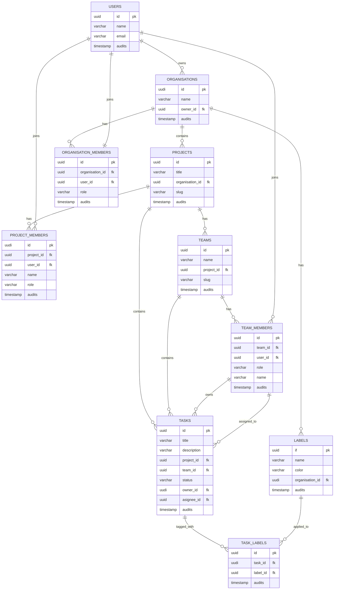

```mermaid
erDiagram
    USERS ||--o{ ORGANISATIONS : owns
    ORGANISATIONS ||--o{ PROJECTS : contains
    ORGANISATIONS ||--o{ ORGANISATION_MEMBERS : has
    USERS ||--|| ORGANISATION_MEMBERS : joins
    
    PROJECTS ||--o{ PROJECT_MEMBERS : has
    USERS ||--o{ PROJECT_MEMBERS : joins
    PROJECTS ||--o{ TEAMS : has
    
    TEAMS ||--o{ TEAM_MEMBERS : has
    USERS ||--o{ TEAM_MEMBERS: joins
    
    PROJECTS ||--o{ TASKS : contains
    TEAMS ||--o{ TASKS: contains
    TEAM_MEMBERS ||--o{ TASKS : owns
    TEAM_MEMBERS ||--o{ TASKS : assigned_to
    
    ORGANISATIONS ||--o{ LABELS : has
    TASKS ||--o{ TASK_LABELS: tagged_with
    LABELS ||--o{ TASK_LABELS: applied_to
    
    
    USERS {
        uuid id pk
        varchar name 
        varchar email
        timestamp audits
    }
    
    ORGANISATIONS{
    uudi id pk
    varchar name
    uuid owner_id fk
    timestamp audits
    }
    
    ORGANISATION_MEMBERS{
        uuid id pk
        uuid organisation_id fk
        uuid user_id fk
        varchar role
        timestamp audits
 }
    
    PROJECTS{
        uuid id pk
        varchar title
        uuid organisation_id fk
        varchar slug
        timestamp audits
 }
    
    PROJECT_MEMBERS{
        uudi id pk
        uuid project_id fk
        uuid user_id fk
        varchar name
        varchar role
        timestamp audits
 }
    TEAMS{
        uuid id pk
        varchar name
        uuid project_id fk
        varchar slug
        timestamp audits
 }
    TEAM_MEMBERS{
        uuid id pk
        uuid team_id fk
        uuid user_id fk
        varchar role
        varchar name
        timestamp audits
 }
    
    TASKS{
        uuid id pk
        varchar title
        varchar description
        uuid project_id fk
        uuid team_id fk
        varchar status
        uudi owner_id fk
        uuid asignee_id fk
        timestamp audits
 }
 
    LABELS{
        uuid if pk
        varchar name
        varchar color
        uudi organisation_id fk
        timestamp audits
 }
    TASK_LABELS{
        uuid id pk
        uudi task_id fk
        uuid label_id fk
        timestamp audits
 }
    
```