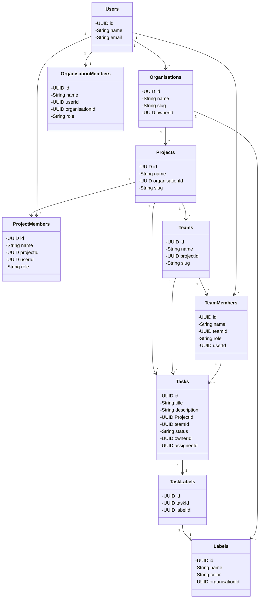

```mermaid

classDiagram
    
    class Users{
        -UUID id
        -String name
        -String email
    }
    
    class Organisations{
        -UUID id
        -String name
        -String slug
        -UUID ownerId
    }
    
    class OrganisationMembers{
        -UUID id
        -String name
        -UUID userId
        -UUID organisationId
        -String role
    }
    
    class Projects{
        -UUID id
        -String name
        -UUID organisationId
        -String slug
    }
    
    class ProjectMembers{
        -UUID id
        -String name
        -UUID projectId
        -UUID userId
        -String role
    }
    
    class Teams{
        -UUID id
        -String name
        -UUID projectId
        -String slug
    }
    
    class TeamMembers{
        -UUID id
        -String name
        -UUID teamId
        -String role
        -UUID userId
    }
    
    class Tasks{
        -UUID id
        -String title
        -String description
        -UUID ProjectId
        -UUID teamId
        -String status
        -UUID ownerId
        -UUID assigneeId
    }
    
    class Labels{
        -UUID id
        -String name
        -String color
        -UUID organisationId
    }
    
    class TaskLabels{
        -UUID id
        -UUID taskId
        -UUID labelId
    }

Users "1" --> "*" Organisations
Organisations "1" --> "*" Projects
Users "1" --> "1" OrganisationMembers
Projects "1" --> "*" ProjectMembers
Users "1" --> "*" ProjectMembers
Projects "1" --> "*" Teams
Teams "1" --> "*" TeamMembers
Users "1" --> "*" TeamMembers
Projects "1" --> "*" Tasks
Teams "1" --> "*" Tasks
TeamMembers "1" --> "*" Tasks
Tasks "1" --> "1" TaskLabels
TaskLabels "1" --> "1" Labels
Organisations "1" --> "*" Labels
```