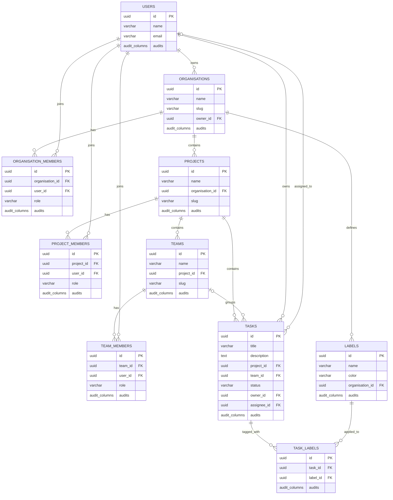

# TaskForge Schema Diagram

This schema diagram is translated from [E-R-diagram.pdf](./E-R-diagram.pdf). It keeps the original entities and relationship intent, but expresses them as implementation-ready relational tables.

## Relationship Notes

- `organisations.owner_id` points to `users.id`.
- `organisation_members`, `project_members`, and `team_members` model membership and role assignment.
- `projects.organisation_id` scopes projects to an organisation.
- `teams.project_id` scopes teams to a project.
- `tasks.project_id` scopes tasks to a project.
- `tasks.team_id` is modeled as optional because a task may exist at project level before being assigned to a team.
- `tasks.owner_id` points to the user who created or owns the task.
- `tasks.assignee_id` is modeled as optional because tasks can be unassigned.
- `labels.organisation_id` scopes reusable labels to an organisation.
- `task_labels` is the many-to-many join table between `tasks` and `labels`.

## Suggested Constraints

- `users.email` should be unique.
- `organisations.slug` should be unique.
- `projects` should have a unique `(organisation_id, slug)`.
- `teams` should have a unique `(project_id, slug)`.
- `labels` should have a unique `(organisation_id, name)`.
- `organisation_members` should have a unique `(organisation_id, user_id)`.
- `project_members` should have a unique `(project_id, user_id)`.
- `team_members` should have a unique `(team_id, user_id)`.
- `task_labels` should have a unique `(task_id, label_id)`.
